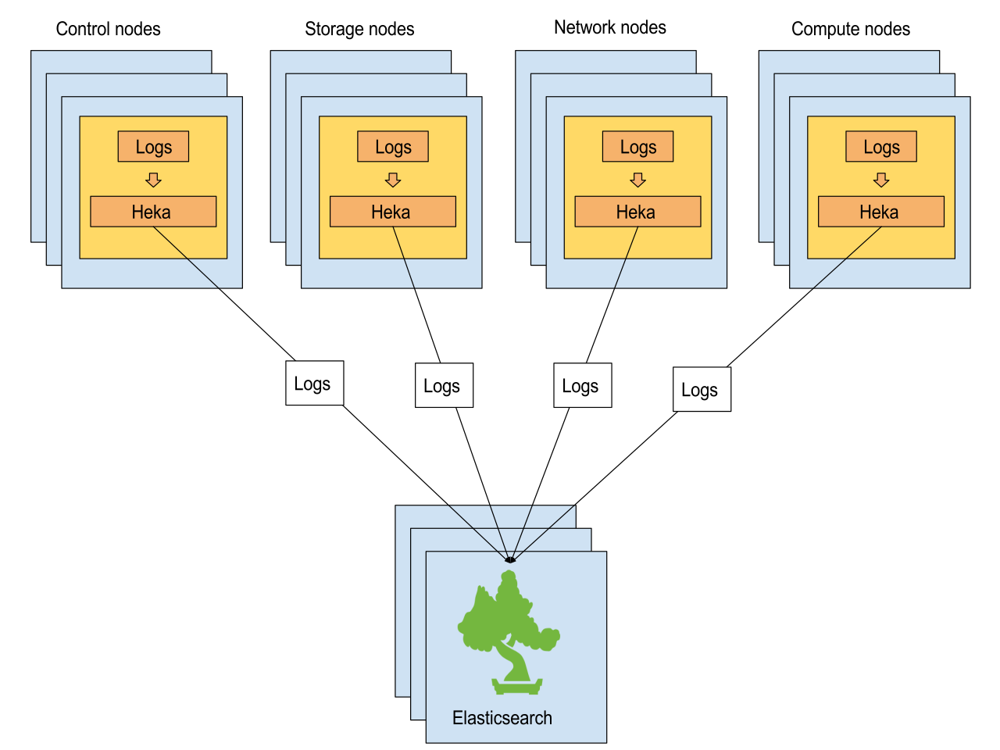

=================
Logging with Heka
=================

https://blueprints.launchpad.net/kolla/+spec/heka

Kolla currently uses Rsyslog for logging. And Change Request ``252968`` [1]
suggests to use ELK (Elasticsearch, Logstash, Kibana) as a way to index all the
logs, and visualize them.

This spec suggests using Heka [2] instead of Logstash, while still using
Elasticsearch for indexing and Kibana for visualization. It also discusses
the removal of Rsyslog along the way.

What is Heka? Heka is a open-source stream processing software created and
maintained by Mozilla.

Using Heka will provide a lightweight and scalable log processing solution
for Kolla.

Problem description
===================

Change Request ``252968`` [1] adds an Ansible role named "elk" that enables
deploying ELK (Elasticsearch, Logstash, Kibana) on nodes with that role. This
spec builds on that work, proposing a scalable log processing architecture
based on the Heka [2] stream processing software.

We think that Heka provides for a lightweight, flexible and powerful solution
for processing data streams, including logs.

Using Heka our primary goal is distributing the logs processing load across the
OpenStack nodes rather than using a centralized log processing engine that
represents a bottleneck and a single-point-of-failure.

We also know from experience that Heka provides all the necessary flexibility
for processing other types of data streams than log messages. For example, we
already use Heka together with Elasticsearch for logs, but also with collectd
and InfluxDB for statistics and metrics.

Proposed change
===============

We propose to build on the ELK infrastructure brought by CR ``252968`` [1], and
use Heka to collect and process logs in a distributed and scalable way.

This is the proposed architecture:

In this architecture Heka runs on every node of the OpenStack cluster. It runs
in a dedicated container, referred to as the Heka container in the rest of this
document.

Each Heka instance reads and processes the logs local to the node it runs on,
and sends these logs to Elasticsearch for indexing. Elasticsearch may be
distributed on multiple nodes for resiliency and scalability, but that part is
outside the scope of that specification.

Heka, written in Go, is fast and has a small footprint, making it possible to
run it on every node of the cluster. In contrast, Logstash runs in a JVM and
is known [3] to be too heavy to run on every node.

Another important aspect is flow control and avoiding the loss of log messages
in case of overload. Heka's filter and output plugins, and the Elasticsearch
output plugin in particular, support the use of a disk based message queue.
This message queue allows plugins to reprocess messages from the queue when
downstream servers (Elasticsearch) are down or cannot keep up with the data
flow.

With Logstash it is often recommended [3] to use Redis as a centralized queue,
which introduces some complexity and other points-of-failures.

Remove Rsyslog
--------------

Kolla currently uses Rsyslog. The Kolla services are configured to write their
logs to Syslog. Rsyslog gets the logs from the ``/var/lib/kolla/dev/log`` Unix
socket and dispatches them to log files on the local file system. Rsyslog
running in a Docker container, the log files are stored in a Docker volume
(named ``rsyslog``).

With Rsyslog already running on each cluster node, the question of using two
log processing daemons, namely ``rsyslogd`` and ``hekad``, has been raised on
the mailing list. The spec evaluates the possibility of using ``hekad`` only,
based on some prototyping work we have conducted [4].

Note: Kolla doesn't currently collect logs from RabbitMQ, HAProxy and
Keepalived. For RabbitMQ the problem is related to RabbitMQ not having the
capability to write its logs to Syslog. HAProxy and Keepalived do have that
capability, but the ``/var/lib/kolla/dev/log`` Unix socket file is currently
not mounted into the HAProxy and Keepalived containers.

Use Heka's ``DockerLogInput`` plugin
------------------------------------

To remove Rsyslog and only use Heka one option would be to make the Kolla
services write their logs to ``stdout`` (or ``stderr``) and rely on Heka's
``DockerLogInput`` plugin [5] for reading the logs. Our experiments have
revealed a number of problems with this option:

* The ``DockerLogInput`` plugin doesn't currently work for containers that have
  a ``tty`` allocated. And Kolla currently allocates a tty for all containers
  (for good reasons).

* When ``DockerLogInput`` is used there is no way to differentiate log messages
  for containers producing multiple log streams. ``neutron-agents`` is an
  example of such a container. (Sam Yaple has raised that issue multiple
  times.)

* If Heka is stopped and restarted later then log messages will be lost, as the
  ``DockerLogInput`` plugin doesn't currently have a mechanism for tracking its
  positions in the log streams. This is in contrast to the ``LogstreamerInput``
  plugin [6] which does include that mechanism.

For these reasons we think that relying on the ``DockerLogInput`` plugin may
not be a practical option.

For the note, our experiments have also shown that the OpenStack containers
logs written to ``stdout`` are visible to neither Heka nor ``docker logs``.
This problem is not reproducible when ``stderr`` is used rather than
``stdout``. The cause of this problem is currently unknown. And it looks like
other people have come across that issue [7].

Use local log files
-------------------

Another option consists of configuring all the Kolla services to log into local
files, and using Heka's ``LogstreamerInput`` plugin [5].

This option involves using a Docker named volume, mounted both into the service
containers (in ``rw`` mode) and into the Heka container (in ``ro`` mode). The
services write logs into files placed in that volume, and Heka reads logs from
the files found in that volume.

This option doesn't present the problems described in the previous section.
And it relies on Heka's ``LogstreamerInput`` plugin, which, based on our
experience, is efficient and robust.

Keeping file logs locally on the nodes has been established as a requirement by
the Kolla developers. With this option, and the Docker volume used, meeting
that requirement necessitates no additional mechanism.

For this option to be applicable the services must have the capability of
logging into files. Most of the Kolla services have this capability. The
exceptions are HAProxy and Keepalived, for which a different mechanism should
be used (described further down in the document). Note that this will make it
possible to collect logs from RabbitMQ, which does not support logging to
Syslog but does support logging to a file.

Also, this option requires that the services have the permission to create
files into the Docker volume, and that Heka has the permission to read these
files. This means that the Docker named volume will have to have appropriate
owner, group and permission bits. With the Heka container running under
a specific user (see below) this will mean using an ``extend_start.sh`` script
including ``sudo chown`` and possibly ``sudo chmod`` commands. Our prototype
[4] already includes this.

As mentioned already the ``LogstreamerInput`` plugin includes a mechanism for
tracking positions in log streams. This works with journal files stored on the
file system (in ``/var/cache/hekad``). A specific volume, private to Heka,
will be used for these journal files. In this way no logs will be lost if the
Heka container is removed and a new one is created.

Handling HAProxy and Keepalived
-------------------------------

As already mentioned HAProxy and Keepalived do not support logging to files.
This means that some other mechanism should be used for these two services (and
any other services that only support logging to Syslog).

Our prototype has demonstrated that we can make Heka act as a Syslog server.
This works by using Heka's ``UdpInput`` plugin with its ``net`` option set
to ``unixgram``.

This also requires that a Unix socket is created by Heka, and that socket is
mounted into the HAProxy and Keepalived containers. For that we will use the
same technique as the one currently used in Kolla with Rsyslog, that is
mounting ``/var/lib/kolla/dev`` into the Heka container and mounting
``/var/lib/kolla/dev/log`` into the service containers.

Our prototype already includes some code demonstrating this. See [4].

Also, to be able to store a copy of the HAProxy and Keepalived logs locally on
the node, we will use Heka's ``FileOutput`` plugin. We will possibly create
two instances of that plugin, one for HAProxy and one for Keepalived, with
specific filters (``message_matcher``).

Read Python Tracebacks
----------------------

In case of exceptions the OpenStack services log Python Tracebacks as multiple
log messages. If no special care is taken then the Python Tracebacks will be
indexed as separate documents in Elasticsearch, and displayed as distinct log
entries in Kibana, making them hard to read. To address that issue we will use
a custom Heka decoder, which will be responsible for coalescing the log lines
making up a Python Traceback into one message. Our prototype includes that
decoder [4].

Collect system logs
-------------------

In addition to container logs we think it is important to collect system logs
as well. For that we propose to mount the host's ``/var/log`` directory into
the Heka container, and configure Heka to get logs from standard log files
located in that directory (e.g. ``kern.log``, ``auth.log``, ``messages``). The
list of system log files will be determined at development time.

Log rotation
------------

Log rotation is an important aspect of the logging system. Currently Kolla
doesn't rotate logs. Logs just accumulate in the ``rsyslog`` Docker volume.
The work on Heka proposed in this spec isn't directly related to log rotation,
but we are suggesting to address this issue for Mitaka. This will mean
creating a new container that uses ``logrotate`` to manage the log files
created by the Kolla containers.

Create an ``heka`` user
-----------------------

For security reasons an ``heka`` user will be created in the Heka container and
the ``hekad`` daemon will run under that user. The ``heka`` user will be added
to the ``kolla`` group, to make sure that Heka can read the log files created
by the services.

Security impact
---------------

Heka is a mature product maintained and used in production by Mozilla. So we
trust Heka as being secure. We also trust the Heka developers as being serious
should security vulnerabilities be found in the Heka code.

As described above we are proposing to use a Docker volume between the service
containers and the Heka container. The group of the volume directory and the
log files will be ``kolla``. And the owner of the log files will be the user
that executes the service producing logs. But the ``gid`` of the ``kolla``
group and the ``uid``'s of the users executing the services may correspond
to a different group and different users on the host system. This means
that the permissions may not be right on the host system. This problem is
not specific to this specification, and it already exists in Kolla (for
the mariadb data volume for example).

Performance Impact
------------------

The ``hekad`` daemon will run in a container on each cluster node. But the
``rsyslogd`` will be removed. And we have assessed that Heka is lightweight
enough to run on every node. Also, a possible option would be to constrain the
Heka container to only use a defined amount of resources.

Alternatives
------------

An alternative to this proposal involves using Logstash in a centralized
way as done in [1].

Another alternative would be to execute Logstash on each cluster node, as this
spec proposes with Heka. But this would mean running a JVM on each cluster
node, and using Redis as a centralized queue.

Also, as described above, we initially considered relying on services writing
their logs to ``stdout`` and use Heka's ``DockerLogInput`` plugin. But our
prototyping work has demonstrated the limits of that approach. See the
``DockerLogInput`` section above for more information.

Implementation
==============

Assignee(s)
-----------

  Éric Lemoine (elemoine)

Milestones
----------

Target Milestone for completion: Mitaka 3 (March 4th, 2016).

Work Items
----------

1. Create an Heka Docker image
2. Create an Heka configuration for Kolla
3. Develop the necessary Heka decoders (with support for Python Tracebacks)
4. Create Ansible deployment files for Heka
5. Modify the services' logging configuration when required
6. Correctly handle RabbitMQ, HAProxy and Keepalived
7. Integrate with Elastichsearch and Kibana
8. Assess logs from all the Kolla services are collected
9. Make the Heka container upgradable
10. Integrate with kolla-mesos (will be done after Mitaka)

Testing
=======

We will rely on the existing gate checks.

Documentation Impact
====================

The location of log files on the host will be mentioned in the documentation.

References
==========

[1] <https://review.opendev.org/#/c/252968/>
[2] <http://hekad.readthedocs.org>
[3] <http://blog.sematext.com/2015/09/28/recipe-rsyslog-redis-logstash/>
[4] <https://review.opendev.org/#/c/269745/>
[5] <http://hekad.readthedocs.org/en/latest/config/inputs/docker_log.html>
[6] <http://hekad.readthedocs.org/en/latest/config/inputs/logstreamer.html>
[7] <https://review.opendev.org/#/c/269952/>
